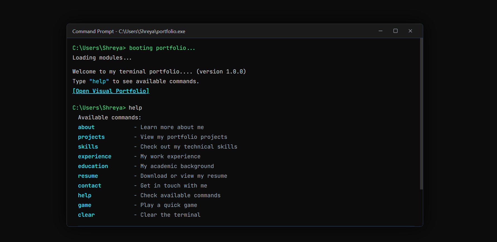
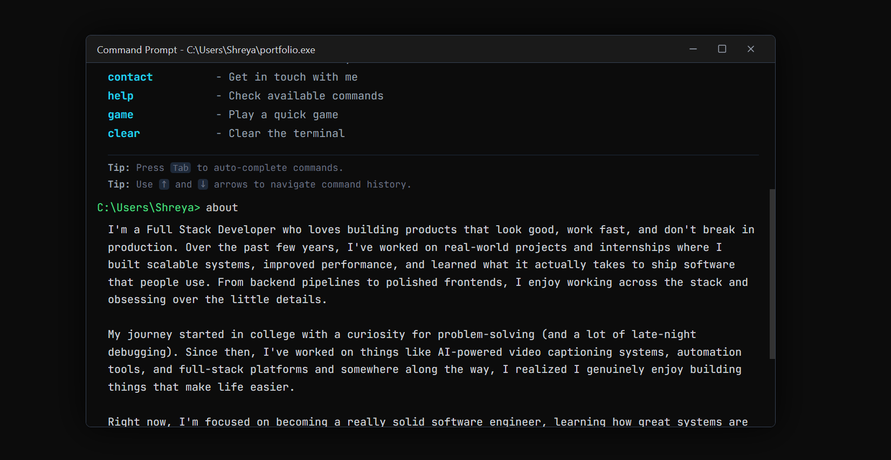

# Personal Portfolio (Terminal) 

Welcome to my interactive, command-line themed personal portfolio! This project simulates a terminal interface where you can explore my experience, projects, skills, and more by typing commands.
View my terminal portfolio: [My Portfolio](https://terminal-portfolio-blue-eight.vercel.app/)

You can view the GUI version here: [GUI Version](https://portfolio-shreya-b.vercel.app/)

## Images





##  Setting up locally

Want to run this terminal portfolio on your own machine or customise it for yourself? Follow these steps:

### Prerequisites
- Node.js (v18 or higher recommended)
- npm, yarn, or pnpm

### Installation Steps

1. **Clone the repository:**
   If you have the code locally, navigate to the project folder:
   ```bash
   cd portfolio-v200
   ```

2. **Install dependencies:**
   ```bash
   npm install
   ```

3. **Start the development server:**
   ```bash
   npm run dev
   ```

4. **Open in browser:**
   Open [http://localhost:3000](http://localhost:3000) with your browser to open local terminal portfolio.

## Making Your Own Changes

You can start editing the content by modifying the components in the `src/components/commands/` directory. Each command (like `about`, `projects`, `skills`, etc.) has its own file managing what is printed to the screen.

- Update your projects in `src/components/commands/ProjectsCommand.tsx`
- Update your experience in `src/components/commands/ExperienceCommand.tsx`
- Update your contact info in `src/components/commands/ContactCommand.tsx`
- General terminal logic is in `src/components/TerminalProvider.tsx`

Feel free to break things, build things, and make the terminal your own!
